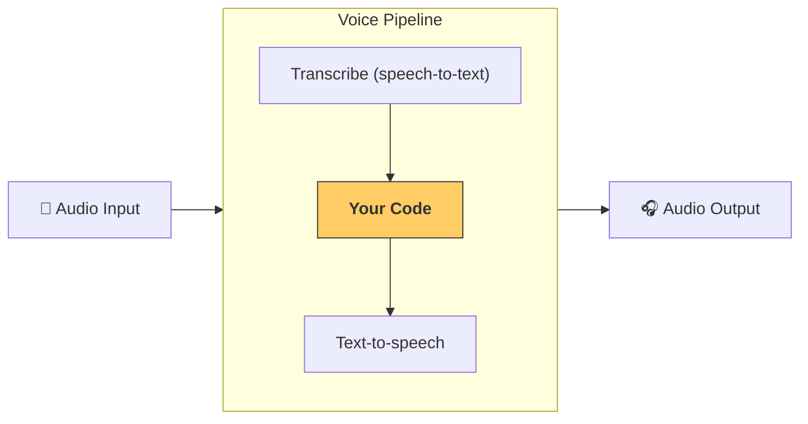

---
search:
  exclude: true
---
# パイプラインとワークフロー

[`VoicePipeline`][agents.voice.pipeline.VoicePipeline] は、エージェント型のワークフローを音声アプリに変換しやすくするクラスです。実行するワークフローを渡すと、パイプラインが入力音声の文字起こし、音声終了の検出、適切なタイミングでのワークフロー呼び出し、そしてワークフロー出力の音声への変換までを処理します。



## パイプラインの設定

パイプラインを作成するとき、次の項目を設定できます。

1. 新しい音声が文字起こしされるたびに実行されるコードである [`workflow`][agents.voice.workflow.VoiceWorkflowBase]
2. 使用する [`speech-to-text`][agents.voice.model.STTModel] と [`text-to-speech`][agents.voice.model.TTSModel] のモデル
3. 次のような設定を行える [`config`][agents.voice.pipeline_config.VoicePipelineConfig]
    - モデル名をモデルにマッピングできるモデルプロバイダー
    - トレーシング（トレーシングを無効化するか、音声ファイルをアップロードするか、ワークフロー名、トレース ID など）
    - プロンプト、言語、使用するデータ型など、TTS と STT モデルの設定

## パイプラインの実行

パイプラインは、[`run()`][agents.voice.pipeline.VoicePipeline.run] メソッドで実行でき、音声入力を次の 2 つの形式で渡せます。

1. [`AudioInput`][agents.voice.input.AudioInput] は、完全な音声の書き起こしがあり、その結果だけを生成したい場合に使います。これは、話者が話し終えたタイミングの検出が不要なケース、たとえば事前録音の音声や、ユーザーの発話終了が明確なプッシュ・トゥ・トーク アプリで有用です。
2. [`StreamedAudioInput`][agents.voice.input.StreamedAudioInput] は、ユーザーの発話終了の検出が必要な場合に使います。検出された音声チャンクを順次プッシュでき、ボイスパイプラインが「アクティビティ検出 (activity detection)」と呼ばれるプロセスにより、適切なタイミングで自動的にエージェントのワークフローを実行します。

## 結果

ボイスパイプライン実行の結果は [`StreamedAudioResult`][agents.voice.result.StreamedAudioResult] です。これは、発生したイベントをストリーミングで受け取れるオブジェクトです。いくつかの種類の [`VoiceStreamEvent`][agents.voice.events.VoiceStreamEvent] があり、次を含みます。

1. 音声チャンクを含む [`VoiceStreamEventAudio`][agents.voice.events.VoiceStreamEventAudio]
2. ターンの開始や終了などのライフサイクルイベントを知らせる [`VoiceStreamEventLifecycle`][agents.voice.events.VoiceStreamEventLifecycle]
3. エラーイベントである [`VoiceStreamEventError`][agents.voice.events.VoiceStreamEventError]

```python

result = await pipeline.run(input)

async for event in result.stream():
    if event.type == "voice_stream_event_audio":
        # play audio
    elif event.type == "voice_stream_event_lifecycle":
        # lifecycle
    elif event.type == "voice_stream_event_error"
        # error
    ...
```

## ベストプラクティス

### 割り込み

Agents SDK は現在、[`StreamedAudioInput`][agents.voice.input.StreamedAudioInput] に対して組み込みの割り込み機能をサポートしていません。検出された各ターンごとに、ワークフローの個別の実行がトリガーされます。アプリケーション内で割り込みを扱いたい場合は、[`VoiceStreamEventLifecycle`][agents.voice.events.VoiceStreamEventLifecycle] イベントをリッスンしてください。`turn_started` は新しいターンが文字起こしされ処理が開始されたことを示します。`turn_ended` は該当するターンのすべての音声がディスパッチされた後に発火します。これらのイベントを用いて、モデルがターンを開始したときに話者のマイクをミュートし、そのターンに関連する音声をすべてフラッシュした後にミュート解除する、といった制御が可能です。