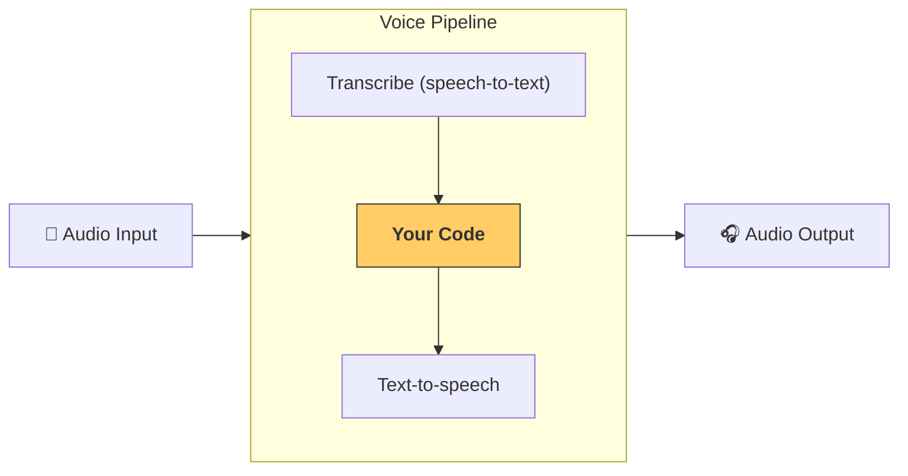

---
search:
  exclude: true
---
# 管道与工作流

[`VoicePipeline`][agents.voice.pipeline.VoicePipeline] 是一个类，可轻松将你的智能体工作流变成语音应用。你传入要运行的工作流，管道会负责转写输入音频、检测音频结束时间、在正确的时机调用你的工作流，并将工作流输出转换回音频。



## 管道配置

创建管道时，你可以设置以下内容：

1. [`workflow`][agents.voice.workflow.VoiceWorkflowBase]：每次转写出新音频时运行的代码。
2. 使用的 [`speech-to-text`][agents.voice.model.STTModel] 和 [`text-to-speech`][agents.voice.model.TTSModel] 模型。
3. [`config`][agents.voice.pipeline_config.VoicePipelineConfig]：用于配置以下内容：
    - 模型提供者，可将模型名称映射到具体模型
    - 追踪，包括是否禁用追踪、是否上传音频文件、工作流名称、追踪 ID 等
    - TTS 与 STT 模型上的设置，如 prompt、语言和所用数据类型

## 运行管道

你可以通过 [`run()`][agents.voice.pipeline.VoicePipeline.run] 方法运行管道，并以两种形式传入音频输入：

1. 当你已有完整音频转写，只想为其生成结果时使用 [`AudioInput`][agents.voice.input.AudioInput]。这在无需检测说话者何时结束的场景很有用；例如，预录音频或在按键说话应用中，用户何时说完是明确的。
2. 当需要检测用户何时说完时使用 [`StreamedAudioInput`][agents.voice.input.StreamedAudioInput]。它允许你在检测到时按块推送音频，语音管道会通过名为“activity detection”的流程在正确的时机自动运行智能体工作流。

## 结果

一次语音管道运行的结果是 [`StreamedAudioResult`][agents.voice.result.StreamedAudioResult]。这是一个对象，可在事件发生时进行流式传递。包含几种 [`VoiceStreamEvent`][agents.voice.events.VoiceStreamEvent] 类型，包括：

1. [`VoiceStreamEventAudio`][agents.voice.events.VoiceStreamEventAudio]，包含一段音频数据。
2. [`VoiceStreamEventLifecycle`][agents.voice.events.VoiceStreamEventLifecycle]，用于通知诸如轮次开始或结束的生命周期事件。
3. [`VoiceStreamEventError`][agents.voice.events.VoiceStreamEventError]，表示错误事件。

```python

result = await pipeline.run(input)

async for event in result.stream():
    if event.type == "voice_stream_event_audio":
        # play audio
    elif event.type == "voice_stream_event_lifecycle":
        # lifecycle
    elif event.type == "voice_stream_event_error"
        # error
    ...
```

## 最佳实践

### 中断

Agents SDK 目前不对 [`StreamedAudioInput`][agents.voice.input.StreamedAudioInput] 提供任何内置的中断支持。相反，对于每个检测到的轮次，它都会单独触发你工作流的一次运行。如果你希望在应用中处理中断，可以监听 [`VoiceStreamEventLifecycle`][agents.voice.events.VoiceStreamEventLifecycle] 事件。`turn_started` 表示新的轮次已被转写且开始处理；`turn_ended` 会在相应轮次的所有音频都已分发后触发。你可以利用这些事件在模型开始一个轮次时静音说话者的麦克风，并在你将该轮次的相关音频全部发送完毕后取消静音。